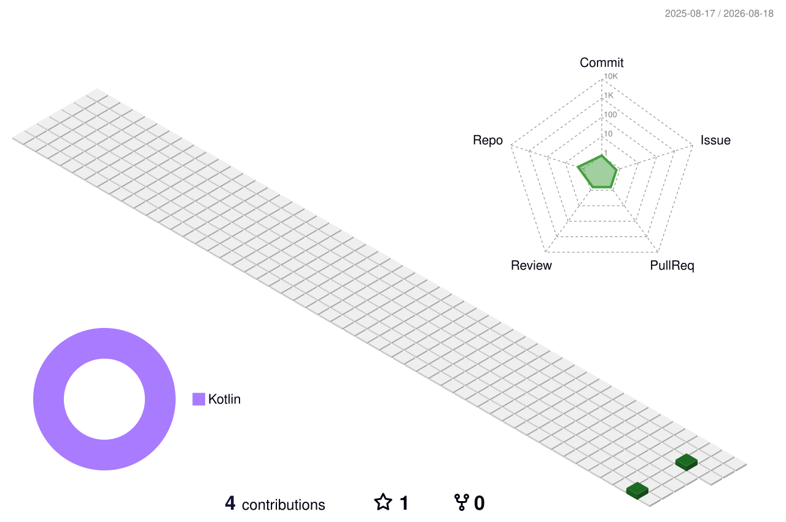

<!--   my-icons -->

    
    
    
    
       

<!--   my-header-img -->

<!--   my-ticker -->    
[;+Welcome+to+My+Profile!;AI+Infra+enthusiast;Always+learning+new+things;Open+source+contributor)](https://git.io/typing-svg)

<!--   my-skils -->
| Property                                        | Data                                                                                                                                                                                                                                                                                                                                                                                                                                                                                                                                                                                                         |
|-------------------------------------------------|--------------------------------------------------------------------------------------------------------------------------------------------------------------------------------------------------------------------------------------------------------------------------------------------------------------------------------------------------------------------------------------------------------------------------------------------------------------------------------------------------------------------------------------------------------------------------------------------------------------|
| **Language / IDE**                              |                                                                                                                     |
| **Domain**                                      |                                                                                                                                                                                 |

<!--   GitHub stats graph -->
### 📈 GitHub Activity Graph:

<!--   green snake -->

<!--   stats + languages -->
| .                                                                                                                                                       | .                                                                                                                             |
|---------------------------------------------------------------------------------------------------------------------------------------------------------|-------------------------------------------------------------------------------------------------------------------------------|
|  |         |

</img>

<!-- dark snake -->

<!--   profile-green-animate -->

**📫 How to Reach me:**

Trophy: Github Profile Trophy

 

#### Thanks for visiting :heart:

---
  *If you liked my profile, you can Star ⭐ the repo and if you want to use this template you can Fork it and can use.* 
---

